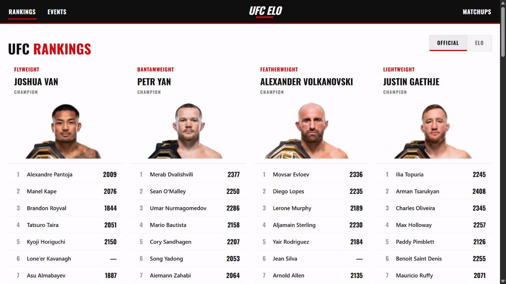
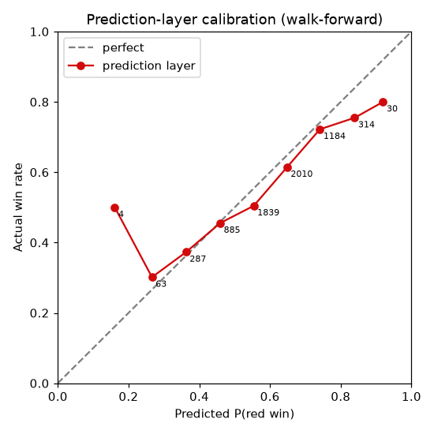

# UFC Elo

> A full-stack combat-sports analytics platform combining historical ratings, fighter profiles, event data, and matchup probabilities.




## Overview

UFC Elo replays the promotion's fight history through a division-aware Glicko-2 engine, then layers matchup features on top to produce calibrated win probabilities. The result is a searchable web product with rankings, fighter profiles, rating histories, upcoming events, odds, and head-to-head analysis.

## What makes the model interesting

- Maintains rating, uncertainty, and volatility separately for each division.
- Expands uncertainty during layoffs instead of silently decaying a fighter's skill.
- Adjusts rating movement for finish type, round, upset magnitude, and fight stakes.
- Transfers fighters between divisions using fitted, monotonic division offsets.
- Keeps matchup features separate from the underlying rating engine.
- Fits age, inactivity, stance, style, rematch, and physical attributes using walk-forward evaluation.
- Records data provenance and preserves conflicting source values for auditability.



## Product surface

- Official and model-based division rankings
- Fighter search, profiles, bios, and rating-history charts
- Upcoming-event cards with predictions and available betting odds
- Any-fighter matchup comparison with an explainable probability breakdown
- FastAPI endpoints for rankings, fighters, events, and matchups

## Architecture

| Directory | Responsibility |
| --- | --- |
| `data/` | SQLite schema, ingestion, scraping, synchronization, and quality reports |
| `elo/` | Glicko-2 engine, features, calibration, backtests, and prediction model |
| `api/` | FastAPI application, caches, serialization, and route modules |
| `web/` | React/TypeScript interface and data visualizations |
| `docs/` | Model, optimization, calibration, and data-quality reports |

## Run locally

```powershell
pip install -r requirements.txt
cd web; npm install; cd ..

python data\sync.py --all
python elo\recompute.py
```

Start the API and frontend in separate terminals:

```powershell
python -m uvicorn api.main:app --port 8000
```

```powershell
cd web
npm run dev
```

Odds enrichment is optional and requires `ODDS_API_KEY`. The checked-in SQLite database lets the application run without performing a fresh ingest.

## Video walkthrough

> 🎬 **Coming soon** — reserved for a tour of rankings, fighter history, and the matchup predictor.
