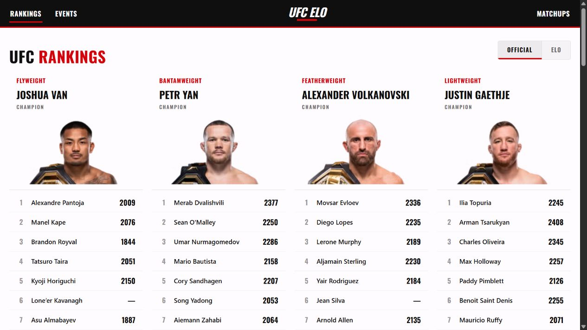
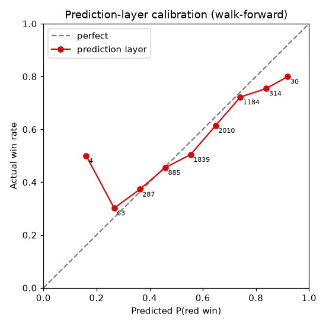

# UFC Elo

**Explore fighter rankings. Understand the matchup. Follow the numbers.**

An independent UFC analytics website with division-aware Glicko-2 ratings, fighter histories, upcoming-event comparisons, and explainable matchup probabilities.

[](https://github.com/PIGJET/ufc-elo/actions/workflows/ci.yml)


[Run locally](#run-locally) · [Publish your website](docs/DEPLOYMENT.md) · [Model evaluation](#model-evaluation) · [API guide](api/README.md) · [Contributing](CONTRIBUTING.md)



## Explore the sport

| Feature | What you can explore |
| --- | --- |
| Rankings | Compare official ranking snapshots with model-based division and pound-for-pound boards. |
| Fighter profiles | Search fighters and inspect their bios, records, fight histories, and rating charts. |
| Upcoming events | Browse scheduled cards, matchup predictions, available odds, and potential rating changes. |
| Matchup explorer | Compare two fighters and see the factors contributing to the prediction. |

The repository includes a SQLite data snapshot and fitted model, so a first local run does not require scraping or an odds API key. Data is a snapshot, not a live feed; odds can be unavailable.

## How it works

Fight history is replayed through separate Glicko-2 rating pools for each division. The engine tracks rating, uncertainty, and volatility. Layoffs increase uncertainty; finish type, upset magnitude, and fight stakes adjust the rating change. Division changes carry information between pools using fitted offsets.

Win probabilities come from a separate prediction layer using rating differences and matchup features such as age, inactivity, stance, style, and physical attributes. The website's predictor is order-invariant: swapping the fighters reverses the probability. Cross-division comparisons include a physical prior and are speculative.

Explore the [rating engine](elo/engine.py), [configuration](elo/config.py), and [prediction model](elo/predict.py) for the implementation. Data ingestion records provenance so conflicting source values can be investigated.

## Model evaluation

The committed [backtest report](docs/backtest_report.md), refreshed September 23, 2026, describes walk-forward evaluation on **6,616 fights from 2013 onward**, refitting each year using earlier fights. It reports two distinct prediction variants:

| Evaluation variant | Log loss | Accuracy |
| --- | ---: | ---: |
| Coin-flip baseline | 0.6931 | 50.0% |
| Vanilla Elo baseline | 0.6846 | 55.8% |
| Corner-aware prediction model | 0.6588 | 60.3% |
| Order-invariant predictor used by the website | 0.6637 | 60.1% |

These are historical results reported in the repository, not guarantees of future performance. The betting-market baseline has not been evaluated because the documented odds table is empty. See the [backtest report](docs/backtest_report.md) for methodology and calibration, and the [optimization report](docs/optimization_report.md) for cross-division assumptions and limitations.



## Run locally

Use Python 3.11 and Node.js 22 with npm, matching the major versions in CI. From a terminal:

```sh
git clone https://github.com/PIGJET/ufc-elo.git
cd ufc-elo
python -m venv .venv
```

Activate the environment with `.venv\Scripts\Activate.ps1` in PowerShell, or `source .venv/bin/activate` in bash/zsh. Then install the backend dependencies:

```sh
python -m pip install -r requirements.txt
python -m uvicorn api.main:app --port 8000
```

In a second terminal, from the repository root:

```sh
cd web
npm ci
npm run dev
```

Open the local URL printed by Vite. The frontend proxies `/api` to port 8000. Interactive API documentation is available at `http://localhost:8000/docs`.

No data refresh is needed to try the committed snapshot. For maintaining a published installation, see [updating the data](docs/DEPLOYMENT.md#updating-the-data).

## Publish the website

The existing [Render blueprint](render.yaml) builds React and serves it with FastAPI as one web service. You do not need separate frontend and backend hosts.

Follow the [deployment guide](docs/DEPLOYMENT.md) to connect the repository, deploy the service, check the public URL, and keep the snapshot current. Review the selected hosting plan and auto-deployment settings before creating the service.

## Verify changes

From the repository root with the Python environment active:

```sh
python -m pip install -r requirements-dev.txt
pytest -q
```

For the frontend:

```sh
cd web
npm ci
npm audit
npm run lint
npm run build
```

Then return to the repository root and exercise the combined production server:

```sh
python tests/smoke_deployment.py
```

GitHub Actions runs the backend, frontend lint/build, and smoke checks on pull requests and pushes to `main`. Run `npm audit` separately on the release commit, then check the live site before sharing it.

## Project map

| Directory | Responsibility |
| --- | --- |
| `data/` | SQLite schema, ingestion, scrapers, synchronization, and provenance |
| `elo/` | Rating engine, features, calibration, backtests, and fitted model |
| `api/` | FastAPI routes, caches, and serialization |
| `web/` | React/TypeScript client, charts, and responsive styling |
| `docs/` | Deployment instructions and model/data reports |

## Data and limitations

- Historical data ingestion uses the public [Greco1899/scrape_ufc_stats](https://github.com/Greco1899/scrape_ufc_stats) export; scraper modules also integrate UFCStats, UFC athlete/ranking/event pages, and optional The Odds API data.
- Snapshot freshness and source availability affect rankings, records, and upcoming cards. Consult the [data-quality report](docs/data_quality_report.md) and verify its date against the release dataset.
- Historical physical attributes are incomplete. The model imputes missing inputs with explicit missing-data indicators.
- Large cross-division weight gaps are extrapolations, not directly validated probability estimates.
- UFC Elo is an independent project and is not affiliated with or endorsed by UFC. Names, images, and source datasets remain subject to their respective owners' rights and terms.

## Contributing

Found a data discrepancy, UI issue, or reproducible bug? [Open an issue](https://github.com/PIGJET/ufc-elo/issues) with the affected fighter/event, what you expected, and supporting evidence. For changes, read [CONTRIBUTING.md](CONTRIBUTING.md).

No project license has been selected yet. Contact the repository owner about reuse permissions; third-party data and images are separate from the project's code.
